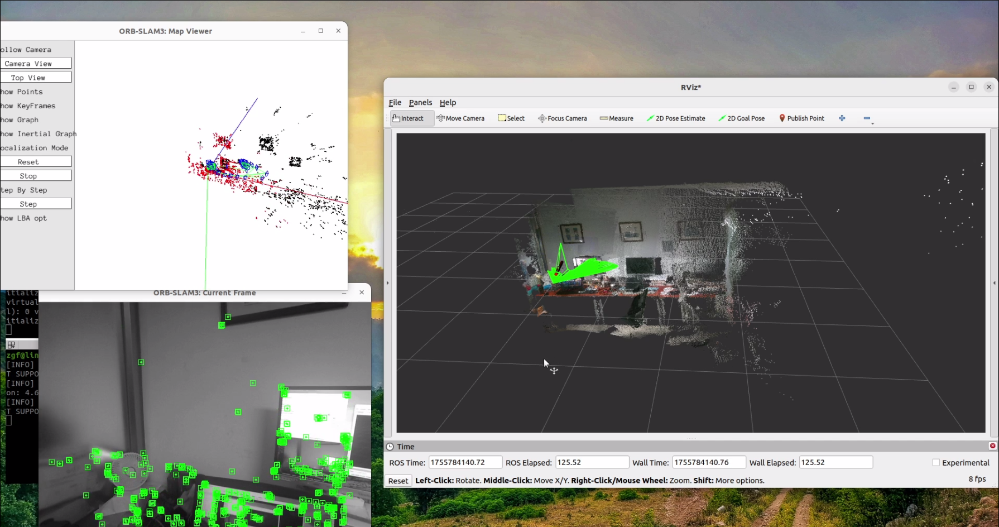

# 1、介绍

本项目基于ORB-SLAM3进行改动，增加了稠密建图功能，使用Realsense D455相机，并并且在ROS2-Humble版本进行了测试。

- 已经在Intel电脑、Jetson Orin NX上进行了测试

- 根据你的项目需求，主要需要更改以下两个文件：src/ros2_slam_publisher.cpp和include/orbslam3_dense_ros2/ros2_slam_publisher.h

- 代码src/main.cpp给出了使用示例，仅RGBD相机可用于稠密建图

# 2、演示视频

# [](https://www.bilibili.com/video/BV1g8Y9zMEZ4/)

# 3、安装

## ROS2安装

本项目使用ROS2-Humble进行了试验，你可以根据[ROS2 Humble安装](https://docs.ros.org/en/humble/Installation.html)指南进行ROS2应用程序安装

## 安装相关依赖

请先预先安装以下程序：

### Eigen3

``` shell
sudo apt install libeigen3-dev
```

### Pangolin

```shell
cd ~
git clone https://github.com/stevenlovegrove/Pangolin
cd Pangolin
git checkout v0.8
mkdir build && cd build
cmake ..
make -j$(nproc)
sudo make install
```

### OpenCV

本项目使用的是带有CUDA加速的OpenCV-4.10,根据项目需求可以自行更改

先更新apt：

```shell
sudo apt update
sudo apt upgrade
```

安装依赖：

```shell
sudo apt install build-essential cmake pkg-config unzip yasm git checkinstall libjpeg-dev libpng-dev libtiff-dev libavcodec-dev libavformat-dev libswscale-dev libgstreamer1.0-dev libgstreamer-plugins-base1.0-dev libxvidcore-dev libx264-dev libmp3lame-dev libopus-dev libmp3lame-dev libvorbis-dev ffmpeg libva-dev libdc1394-25 libdc1394-dev libxine2-dev libv4l-dev v4l-utils libgtk-3-dev libtbb-dev libatlas-base-dev gfortran libprotobuf-dev protobuf-compiler libgoogle-glog-dev libgflags-dev libgphoto2-dev libeigen3-dev libhdf5-dev doxygen
```

添加libv4l1-videodev软连接：

```shell
sudo ln -s /usr/include/libv4l1-videodev.h /usr/include/linux/videodev.h
```

安装OpenCV：

```shell
cd ~
mkdir opencv && cd opencv
wget -O opencv.zip https://github.com/opencv/opencv/archive/refs/tags/4.10.0.zip
wget -O opencv_contrib.zip https://github.com/opencv/opencv_contrib/archive/refs/tags/4.10.0.zip
unzip opencv.zip
unzip opencv_contrib.zip
cd opencv-4.10.0
mkdir build
cd build
```

> 运行下面代码时需要注意：
> 
> - **OPENCV_PYTHON3_INSTALL_PATH**换成实际python3环境
> - 如果要安装CUDA版本OpenCV，需要根据GPU更改**CUDA_ARCH_BIN**的值，可以在[显卡计算能力](https://developer.nvidia.com/cuda-gpus)找到显卡的计算能力
> **OPENCV_PYTHON3_INSTALL_PATH**
> 注意带有CUDA和CUDNN的选项目，根据你自己的需求选择

```shell
cmake .. -D CMAKE_BUILD_TYPE=RELEASE \
-D CMAKE_INSTALL_PREFIX=/usr/local \
-D WITH_TBB=ON \
-D ENABLE_FAST_MATH=1 \
-D CUDA_FAST_MATH=1 \
-D WITH_CUBLAS=1 \
-D WITH_CUDA=ON \
-D BUILD_opencv_cudacodec=OFF \
-D WITH_CUDNN=ON \
-D OPENCV_DNN_CUDA=ON \
-D CUDA_ARCH_BIN=7.5 \
-D WITH_V4L=ON \
-D WITH_QT=OFF \
-D WITH_OPENGL=ON \
-D WITH_GSTREAMER=ON \
-D OPENCV_GENERATE_PKGCONFIG=ON \
-D OPENCV_PC_FILE_NAME=opencv.pc \
-D OPENCV_ENABLE_NONFREE=ON \
-D OPENCV_PYTHON3_INSTALL_PATH=~/.virtualenvs/opencv/lib/python3.12/site-packages/ \
-D PYTHON_EXECUTABLE=~/.virtualenvs/opencv/bin/python \
-D OPENCV_EXTRA_MODULES_PATH=~/Downloads/opencv/opencv_contrib-4.10.0/modules \
-D INSTALL_PYTHON_EXAMPLES=OFF \
-D INSTALL_C_EXAMPLES=OFF \
-D BUILD_EXAMPLES=OFF
```

进行编译和安装：

```shell
make -j$(nproc)
sudo make install
sudo /bin/bash -c 'echo "/usr/local/lib" >> /etc/ld.so.conf.d/opencv.conf'
sudo ldconfig
```

## 安装和使用

请先创建工作空间，或者把本项目代码直接放到工作空间的src文件夹下

```shell
mkdir -p ~/robot_ws/src
cd ~/robot_ws/src
git clone https://github.com/zgfbupt/orbslam3_dense_ros2.git
cd ../
colcon build --packages-select orbslam3_dense_ros2
```

使用：

```shell
source ~/robot_ws/install/setup.bash
ros2 run orbslam3_dense_ros2 orb_slam3_main
```

# 4、参考

1、https://github.com/Mechazo11/ros2_orb_slam3

2、https://github.com/LeonardoDiCaprio1/Map_ORBSLAM_ROS/

